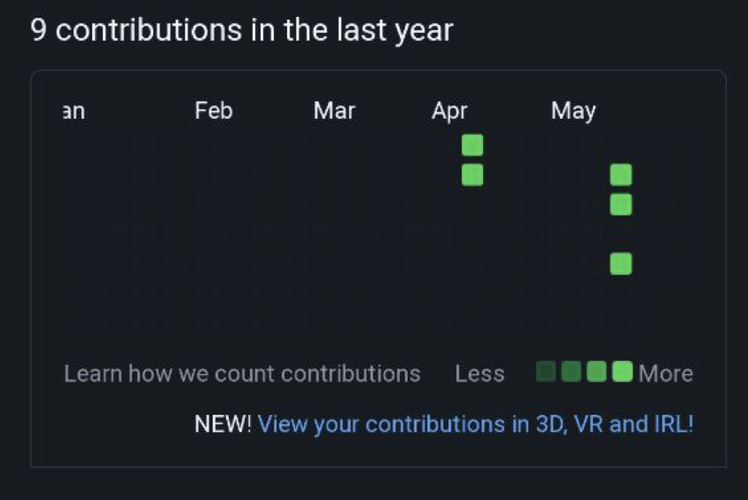
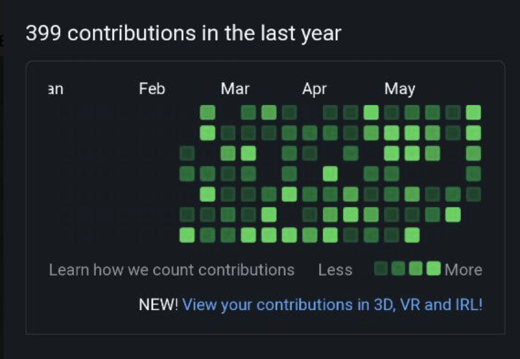

# commit-a-lot
Заполнение активности гитхаб профиля. 
=========================

Скрипт позволяет моментально заполнить активностью свой гитхаб профиль.

### До :neutral_face: :no_mouth: :unamused: 

### После :muscle: :relieved: :heart: :sunglasses: :metal: :horse: :wink: :fire: :dancer: :santa: :fireworks: :cherries: :tada:


## Как пользоваться?
1. Создайте пустой репозиторий GitHub. Не инициализируйте его.
2. Скачайте [скрипт contribute.py]() 
и выполните его, передав ссылку на созданный репозиторий
```sh
python contribute.py --repository=git@github.com:user/repo.git
```
Теперь у вас есть репозиторий с большим количеством изменений в вашем аккаунте GitHub.
Примечание: GitHub потребуется несколько минут для переиндексации вашей активности.

## Как это работает
Сценарий инициализирует пустой git-репозиторий, создает текстовый файл и начинает генерировать изменения в файле за каждый день в течение последнего года (0-20 коммитов 
в день). После генерации коммитов он связывает созданный репозиторий с удаленным репозиторием и переносит изменения.

## Сделать вклад приватным
Теперь вам нужно только настроить свою учетную запись [на отображение приватных коммитов](https://help.github.com/en/articles/publicizing-or-hiding-your-private-contributions-on-your-profile).
Таким образом, пользователи GitHub увидят, что вы внесли свой вклад, но не смогут увидеть, что именно.

## Customizations
Вы можете настроить частоту комммитов, количество коммитов в день и т.д.
Например, с помощью следующей команды сценарий будет делать от 1 до 12 коммитов в день. Он будет выполнять коммиты 60% дней в году.
```sh
python contribute.py --max_commits=12 --frequency=60 --repository=git@github.com:user/repo.git
```
Используй `--no_weekends` опцию, если не хочешь "коммитить" в выходные.
```sh
python contribute.py --no_weekends
```
Если вы не зададите аргумент `--repository`, скрипт не будет пушить изменения. Таким образом, вы можете импортировать созданный репозиторий самостоятельно.

Используйте `--days_before` и `--days_after`, чтобы указать, за сколько дней до текущей даты скрипт должен начать коммиты, и через сколько дней после текущей даты он
будет продолжать это делать.

```sh
python contribute.py --days_before=10 --days_after=15
```

Для получения помощи запусти `python contribute.py --help`.

#### Если не выходит
Убедитесь, что адрес электронной почты, указанный в GitHub, совпадает с адресом в ваших локальных настройках. GitHub учитывает вклад только в том случае, если он сделан с использованием соответствующего адреса электронной почты.

Получить git настройки
```
git config --get user.email
```
Если она не совпадает с той, что на GitHub, сбросьте ее с помощью
```
git config --global user.email "user@example.com"
```
Создай новую репо и перезапусти скрипт

#### Всё равно ошибки.
Возможно, вы пытались использовать существующий репозиторий. Если это так, убедитесь, что вы используете новое репо, которое *не инициализировано*.